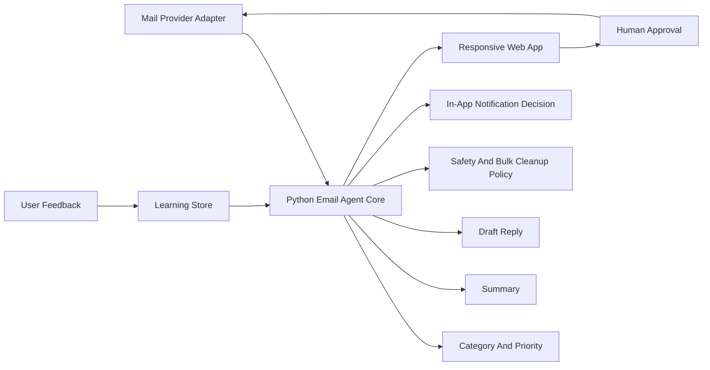

# Architecture

## Overview

The app is organized around a Python email-agent pipeline:

## Main Modules

- `app.py`: local entrypoint.
- `src/email_ai_assistant/server.py`: Python HTTP server and API routes.
- `src/email_ai_assistant/agent.py`: mailbox analysis, classification, summary, draft, alert decisions.
- `src/email_ai_assistant/categories.py`: category definitions, protected categories, and cleanable categories.
- `src/email_ai_assistant/model_router.py`: configurable model routes for triage, summary, drafting, safety, and memory.
- `src/email_ai_assistant/policy.py`: safety policy for send, Trash, bulk cleanup, and alert actions.
- `src/email_ai_assistant/learning_store.py`: stores user feedback as daily preference memory.
- `src/email_ai_assistant/integrations/mail_provider.py`: mail provider adapter boundary.
- `src/email_ai_assistant/integrations/notification_provider.py`: in-app notification adapter boundary.
- `public/`: responsive browser UI.
- `tests/`: Python unit test suite.

## Real Provider Path

1. Add OAuth to `mail_provider.py`.
2. Add provider-specific message fetch, label, archive, Trash, draft, and send functions.
3. Add Telegram, SMS, email notification, or WhatsApp later only if needed.
4. Replace the current deterministic rule engine with model calls behind `model_router.py` while keeping the same returned analysis shape.
5. Keep the human approval gate for sending and high-risk cleanup actions.

Gmail OAuth is implemented with local credentials in `private/gmail_credentials.json` and local tokens in `private/gmail_token.json`. Both are ignored by Git.

## Bulk Cleanup

The UI supports selecting individual cleanable messages or selecting all cleanable messages in the current filter. The backend re-checks every selected email before moving it to Trash.

Cleanable by default:

- Low-value loan offers.
- Marketing promotions.
- Social updates.

Protected by default:

- Salary, bank, finance, HR, company, recruiter, career, home renewal, personal, and uncertain mail.

Permanent deletion is disabled in the first release.

## Daily Learning

The first release stores corrections and user decisions in `data/agent-memory.json`. Future releases can move this to SQLite, Postgres, Cloudflare D1, or another encrypted database. The agent should use memory to adjust:

- Important senders.
- Blocked promotional senders.
- Category overrides.
- Preferred draft tone.
- Alert thresholds.
- Auto-trash confidence thresholds.

## Risk Controls

- Sending is approval-only.
- Permanent deletion is not available in the first release.
- Trash recommendations are separated from actual provider actions.
- Bulk cleanup is validated on the backend before any provider action.
- Draft attachments are local approved files from `private/cv.pdf` or `private/attachments/`.
- Model outputs should be validated by `policy.py` before any external action.
